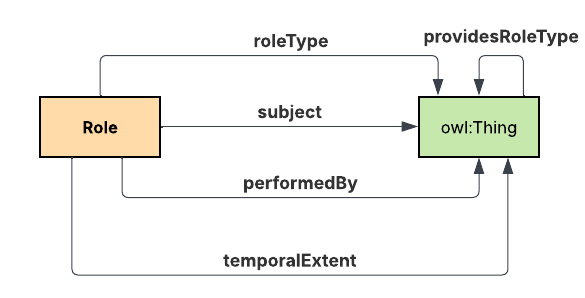
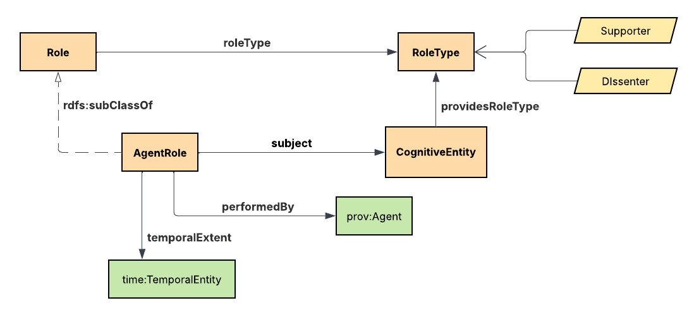
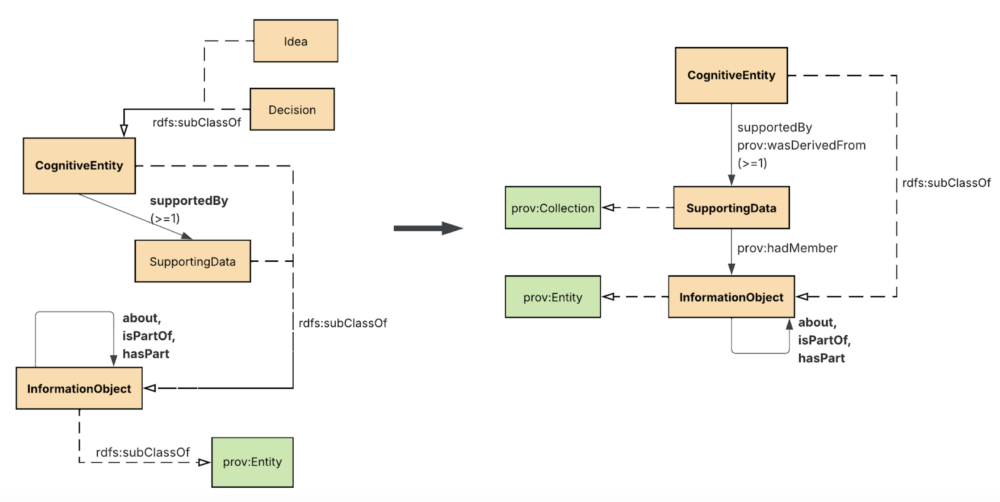

Google Doc: https://docs.google.com/document/d/1sKlAThT08eFLGffO7NiSiuyVBL7SI6dINJ8dX8n9CXc/edit?tab=t.0

## BACKGROUND - Idea/Decision Knowledge Graph

My knowledge graph describes the data that support ideas like decisions, hypotheses and beliefs.  The vision is that it can be used across multiple domains and use cases for organizations or people that want to easily rediscover the content that supported a particular idea.

Questions they may ask are:
- Where was the data stored? (podcast, article, book, film, song)
- Who is the author of that data?
- Has newer data emerged that contradict this idea?
- Who supports or dissents to an idea?


## 1-Modularizing a KG: 
Briefly describe how you might create separable and composable modules for your knowledge graph. Consider some or all of the capabilities presented:

**Named Graphs** - I envision named graphs at the “Idea Level”. For each idea there would be a named graph -  for the idea itself, its supporting data, and annotations from the curator of the idea. The idea graph is the domain in which the curator decides what is relevant. Adjacently, I envision 2 related named graphs - for 1) provenance of changes to the idea named graph, and 2) inferred triples. 

An Idea: `urn:dikw:user:1234:idea:5678`
Idea Provenance: `urn:dikw:user:1234:idea:5678:provenance`
Idea Inferences: `urn:dikw:user:1234:idea:5678:inferred`

**Ontology Imports** - A lot of my model extends PROV-O, and in importing the ontology in Protege I found it difficult to work on with the additional classes and properties. My own constructs get lost within the tool. For that reason, I decided to import PROV-O in my material graph in its own named graph instead to enable reasoning and inference and keep my ontology separate.

**Modularity** - In the design of my ontology I reused a pattern for describing the role of particular agents. For that I decided to store the Role pattern in its own TTL file and import that into my ontology. This way the Role pattern can be used in other ontology without introducing bloat or entanglements. The AgentRole class in my ontology extends the Role class from the pattern. This role pattern is defined as an ontology and imported into the Idea KG ontology


**Figure 1**: The Role pattern



**Figure 2**: The Role pattern extended for the Idea KG

## 2-Time and Space:
Describe a use case for your knowledge graph and explain how and why you would adapt your knowledge graph design to handle one or more of these issues.

**Space** - My KG focuses primarily on immaterial things. However, some of the data can be material or describe physical locations. The supporting data for an idea may even be stored as digital objects in locations with “electronic addresses” (borrowing from GIST). Examples: files or issue comments in Github, S3 locations of files in an object store, or a URL to article. For data (InformationObject class), it could be a  quote that is part of a Podcast. That podcast would be a file with possibly some “electronic address” like a URL.  

**Time** - I appreciate the flexibility and granularity of the OWL Time ontology. I find it useful to be able to describe with properties like inXSDDateTimeStamp for efficient time-based SPARQL querying, but also the ability to include parts of dates like in the time:GeneralDateTimeDescription class. These parts also support improved querying for my KG where partial dates may be all that is known. In this case, expressivity of users trumps accuracy.

**Events** - In this KG, events are most typically annotations/modifications of an Idea. It seems important to capture changes to an Idea over time. So, I use the provenance named graph (urn:dikw:user:1234:idea:5678:provenance) to store these events using standard PROV-O. 

## 3-Groups of Entities: 
Describe a technical scenario or use case for your knowledge graph design where you might want or need to represent groups of entities. Describe how you might use graph capabilities such as:

**Enumerations & Cardinality Constraints** - I refactored my original model such that the class SupportingData (all InformationObjects that support at least 1 Idea) to instead be a subclass of prov:Collection. As a Collection, members form a set of InformationObjects that can be reused. For example a set of SupportingData can be reused to support more than one single Idea. Knowing that in the KG might provide deeper insights. For UI, the set can be more easily assigned or annotated itself. For example, if a set of InformationObjects have been disproved or dissented to, that can also be achieved with the set. CognitiveEntity requires the existence of at least 1 SupportingData, and so a cardinality constraint is placed upon the class definition for CognitiveEntity:

```
[ rdf:type owl:Restriction ;
        owl:onProperty :supportedBy ;
        owl:minQualifiedCardinality "1"^^xsd:nonNegativeInteger ;
        owl:onClass :SupportingData
]
```


**Figure 3**: SupportingData to prov:Collection

**Enumerations (cont’d)** - I also realized that my AgentRole pattern could be re-used for permissions and privileges for other agents to interact with CognitiveEntity’s owned by other users. In order to group just agent roles that are about supporting or opposing a CognitiveEntity, I created a new class called “Claimant” as equivalent to any RoleType whose value is one of RoleType_Dissenter or RoleType_Supporter.

```:Claimant rdf:type owl:Class ;
          owl:equivalentClass [ owl:intersectionOf ( :RoleType
                                                     [ rdf:type owl:Class ;
                                                       owl:oneOf ( :RoleType_Dissenter :RoleType_Supporter )
                                                     ]
                                                   ) ;
                                rdf:type owl:Class
                              ] ;
          rdfs:comment "An RoleType whose value is one of support or opposition." ;
          rdfs:label "Claimant" .
```

## 4-Graph Queries: 
Using a graph query language(s) available to you, demonstrate what you have learned in MC-2 for your application requirements for inserts, updates, visualization, and analysis. Show at least three queries with result sets.

###4a. Querying across named graphs - the dates of all changes to supporting data

```
PREFIX dikw: <https://schema.harborlight.tech/ontology/dikw/>
PREFIX prov: <http://www.w3.org/ns/prov#>

SELECT ?change_date ?change_agent ?changed_for
FROM NAMED <urn:dikw:user:1234:idea:5678>
FROM NAMED <urn:dikw:user:1234:idea:5678:provenance>
WHERE {
 GRAPH <urn:dikw:user:1234:idea:5678> {
   ?supporting_data a dikw:SupportingData .
   ?change prov:used ?supporting_data .
   ?change a prov:Activity .
 }
 GRAPH <urn:dikw:user:1234:idea:5678:provenance> {
   ?changelog prov:wasInformedBy ?change .
   ?changelog a prov:Activity .
   ?changelog prov:endedAtTime ?change_date .
   ?changelog prov:wasAssociatedWith ?change_agent .
   OPTIONAL { ?change_agent prov:actedOnBehalfOf ?changed_for }
 }
}
ORDER BY ?change_date ?change_agent
```

#### ResultSet
?change_date
?change_agent
?changed_for
“2025-11-13T11:06:41Z”
urn:dikw:user:1234


“2025-11-15T08:21:05Z”
urn:dikw:user:1234


“2025-11-15T12:50:52Z”
urn:dikw:user:xyz
urn:dikw:user:1234


**Figure 4**: Feeding this data into Claude.ai it rendered a timeline visualization for the user’s query.

###4b. Querying for all Claimants (owl:oneOf) of an specific idea in 2021

```
PREFIX dikw: <https://schema.harborlight.tech/ontology/dikw/>
PREFIX role: <https://schema.harborlight.tech/ontology/pattern/role/>
PREFIX time: <http://www.w3.org/2006/time#>

SELECT DISTINCT ?agent_name ?role_type_label
FROM NAMED <urn:dikw:user:1234:idea:5678>
# Claimant class would be inferred
FROM NAMED <urn:dikw:user:1234:idea:5678:inferred>
WHERE {
   BIND(<urn:dikw:user:1234:idea:5678> AS ?idea)
   ?agent_role role:subject ?idea .
   ?agent_role role:roleType ?role_type.
   ?role_type a dikw:Claimant .
   ?agent_role role:performedBy/dikw:name ?agent_name .
   ?agent_role dikw:temporalExtent ?date_range .    
   OPTIONAL {
     ?date_range time:hasDateTimeDescription/time:year ?year .
     FILTER ((STR(?year) = “2021”))
   }
   OPTIONAL {
     ?date_range time:hasBeginning/time:inXSDDateTimeStamp ?begin .
     ?date_range time:hasEnd/time:inXSDDateTimeStamp ?end .
      FILTER (?begin <= "2021-12-31T23:59:59"^^xsd:dateTimeStamp && 
          ?end >= "2021-01-01T00:00:00"^^xsd:dateTimeStamp)
   }
   ?role_type dikw:name ?role_type_label .
}
ORDER BY DESC(?role_type_label) ?agent_name
```

#### ResultSet 
?agent_name
?role_type_label
“JL Collins”
Supporter
“Mr. Money Mustache”
Supporter
“Robert Kiyosaki”
Dissenter


### 4c. Get all ideas whose SupportingData contains podcast ‘A’

This query would traverse all curator’s ideas across the whole graph and find all ideas that share a source of supporting data. Some pieces of data are nested in dikw:hasPart/dikw:isPartOf recursive trees for example:

```
:insightful-phrase-01 a dikw:InformationObject;
   rdf:value “Lorem ipsum blah blah blah” ;
   dikw:isPartOf :podcast-01 .

:podcast-01 a dikw:InformationObject;
   rdf:value “Podcast ABC” ;
   dikw:isPartOf :podcast-series-01 .

:podcast-01 a dikw:InformationObject;
   rdf:value “Podcast Series about Cool Stuff” .
```

```
PREFIX dikw: <https://schema.harborlight.tech/ontology/dikw/>
PREFIX prov: <http://www.w3.org/ns/prov#>
SELECT DISTINCT ?idea ?name
WHERE {
  ?idea dikw:supportedBy ?supporting_data .
  ?supporting_data a dikw:SupportingData .
  BIND (<urn:dikw:data:987> as ?podcast_a)
  {
    ?supporting_data prov:hadMember ?podcast_a .
  }
  UNION
  {
    ?supporting_data prov:hadMember ?data .
    ?data dikw:hasPart+ ?podcast_a
  }
  UNION
  {
    ?supporting_data prov:hadMember ?data .
    ?data dikw:isPartOf+ ?podcast_a
  }

  ?idea dikw:name ?name
}
```

#### ResultSet
?idea
?name
<urn:dikw:idea:1>
“4% Rule is a Viable Retirement Withdrawal Strategy”
<urn:dikw:idea:3>
“VTSAX is the best low-cost index fund”

## 5-RDF vs LPGs: 

How do the topics in MC-2 affect your choices for design and graph representation? Does the graph representation enhance or constrain the ability of your knowledge graph to handle these technical scenarios and use cases?

Property graphs don't have native named graph support. I would  need to model this using node/edge properties that I think creates unnecessary complexity. But, I heard the idea of using both in class, and that was interesting. I wonder if given some specific use cases for UI visualizations like a timeline of change events from the provenance graph. I wonder if the provenance graph could be exported as a simplified node/edge graph and stored in a LPG for better performance of visualization and analytics. 
